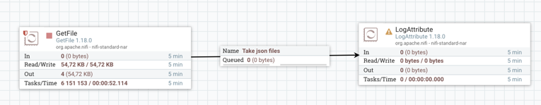
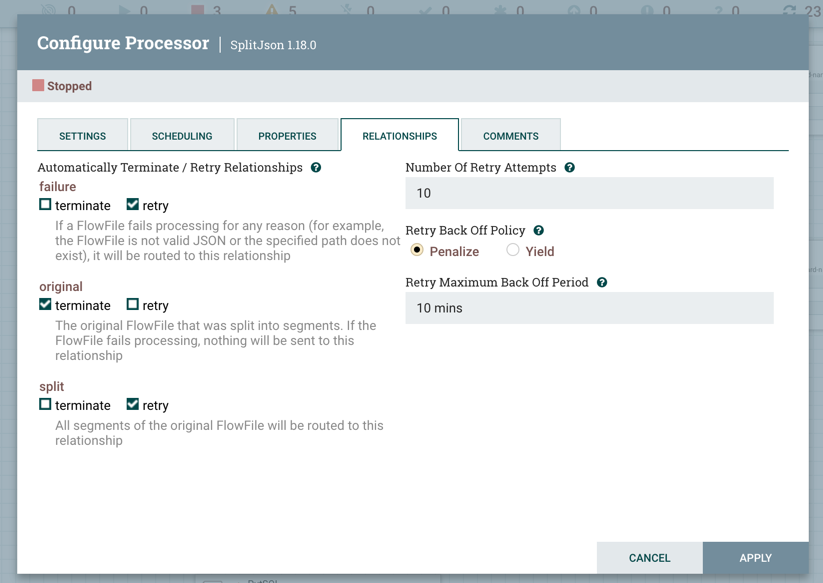
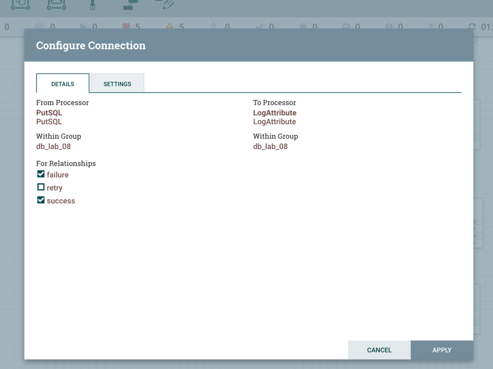

## Лабораторная работа №8

Использование ETL инструментов на примере NiFi

### Краткий экскурс

[**NiFi**](https://habr.com/ru/company/rostelecom/blog/432166/) — это open source ETL/ELT-инструмент, который умеет работать со множеством систем.

[**ETL/ELT**](https://habr.com/ru/post/695546/) - два способа интеграции данных в одно хранилище.

> Основное различие между ними заключается в том, ГДЕ и КОГДА выполняются преобразование и загрузка данных. 
> При ETL данные преобразуются на временном этапе подготовки до того, как попадут в целевой репозиторий, 
> в то время как ELT позволяет преобразовывать данные после их загрузки в целевую систему. 

Расшифровка: *EXTRACT LOAD TRANSFORM* 

### Как выполнять и запускать данныю лр

1. Стырьте у меня main.py, где происходит создание json-файлика (немного переделав под себя естесственно)
2. Поставьте [nifi](https://nifi.apache.org/docs.html)
    ```bash
   # Установка
   brew install nifi
  
   # Запуск
   nifi start
   
   # Проверка работы
   nifi status
   
   # Завершение
   nifi stop
   ```
3. Создайте пользователя и зайдите в веб интерфейс
    ```bash
    nifi start
    nifi set-single-user-credentials <username> <password>
    nifi stop 
    ```
   
    ```bash
    nifi start
    # Открываем
    https://localhost:8443/nifi
    ```
4. Создаем новую группу
   

5. Правая кнопка мыши -> enter group -> зашли в группу
6. Перетаскиваем на поле необходимые процессоры

   (выбираем Processor, в поиске вбиваем название как в лабе)
   

7. Делаем первую тестовую связку
   
   
8. Запускаем тестовую связку
   
   Потом также стоп

   Если подождете достаточно времени, то очередь будет выглядеть так 
   
9. Настраиваем блок `ConvertRecord`
   
   
   
10. Также в этом блоке нужно настроить ридера и врайтера 
       * жмакаем на кнопку -> 
       * в открывшемся окне нажимаем на молнии справа, чтобы получилась такая картина
   

   Промежуточный результат
   
11. Настраиваем блок `split`
   
   
   

   Промежуточный результат
   
12. Пытаемся настроить соединение 
   
   
   
   
   
    (в папке nifi_tools лежит архив постгреса)
13. Put
   
14. Важно! Когда вы настраиваете любую связь не забывайте прописывать, что хотите передавать
   